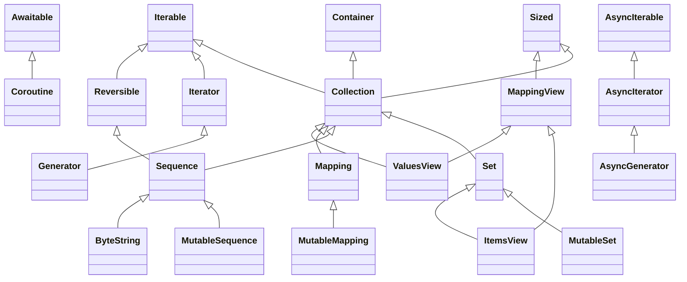

# Creating Custom Data Structures from Abstract Containers in `collections.abc`

Python's `collections.abc` module provides a set of abstract base classes (ABCs) that define the interfaces for various container types. These ABCs serve as excellent starting points when you need to create custom data structures that behave like built-in containers. In this post, we'll explore the hierarchy of these abstract containers and explain why inheriting from them is beneficial.

## The Hierarchy of Abstract Containers

The abstract container classes in `collections.abc` form a logical inheritance hierarchy that mirrors how we think about container relationships:

- **Container** (requires `__contains__`)
   - Defines the `in` operator behavior

- **Iterable** (requires `__iter__`)
   - Adds iteration capability

- **Sized** (requires `__len__`)
   - Adds length measurement capability

- **Collection** (combines `Container`, `Iterable`, and `Sized`)
   - A complete basic collection

From these fundamental abstract container classes, more specialized containers branch out:

- **Sequence** (combines `Reversible` and `Collection`, and also requires `__getitem__`)
  - Represents immutable sequences (like tuple)
  - Provides `index()` and `count()` **automatically**

- **Mapping** (inherits from `Collection`, and also requires `__getitem__`)
  - Represents read-only dictionaries
  - Provides `get()`, `items()`, `keys()`, `values()` **automatically**

- **Set** (inherits from `Collection`, requires no more methods)
  - Represents immutable sets
  - Provides `isdisjoint()` and support for `&`, `|`, `-`, `^`, `<`, `<=`, `>`, `>=`, `==` operations **automatically**

The inheritance hierarchy of all abstract container classes is as follows:



To get a list of all abstract methods you must implement when inheriting an abstract container class, you can use the following function:

```python
import abc


def get_all_abstract_methods(abstract_base_class):
    # type: (type) -> list[str]
    all_abstract_methods = set()

    for mro_entry in abstract_base_class.__mro__:
        if isinstance(mro_entry, abc.ABCMeta) or hasattr(mro_entry, '__abstractmethods__'):
            for abstract_method in mro_entry.__abstractmethods__:
                all_abstract_methods.add(abstract_method)

    return sorted(all_abstract_methods)
```

## Why Inherit from Abstract Containers?

When you create a custom data structure by inheriting from these abstract container classes, you get several benefits:

- **Interface Clarity**: The abstract container classes clearly document what abstract methods your class needs to implement to be a proper container (see `get_all_abstract_methods` above).
- **Type Checking Compatibility**: Your custom class will be recognized as the proper type by `isinstance()` and `issubclass()` checks, as well as by third-party type-checking tools such as `mypy`.
- **Automatic Method Implementation**: The abstract container classes provide many methods automatically once you implement the required abstract methods (see the examples of `Sequence`, `Mapping`, and `Set` above).
- **Consistent Behavior**: Your custom container will behave like Python developers expect it to.
