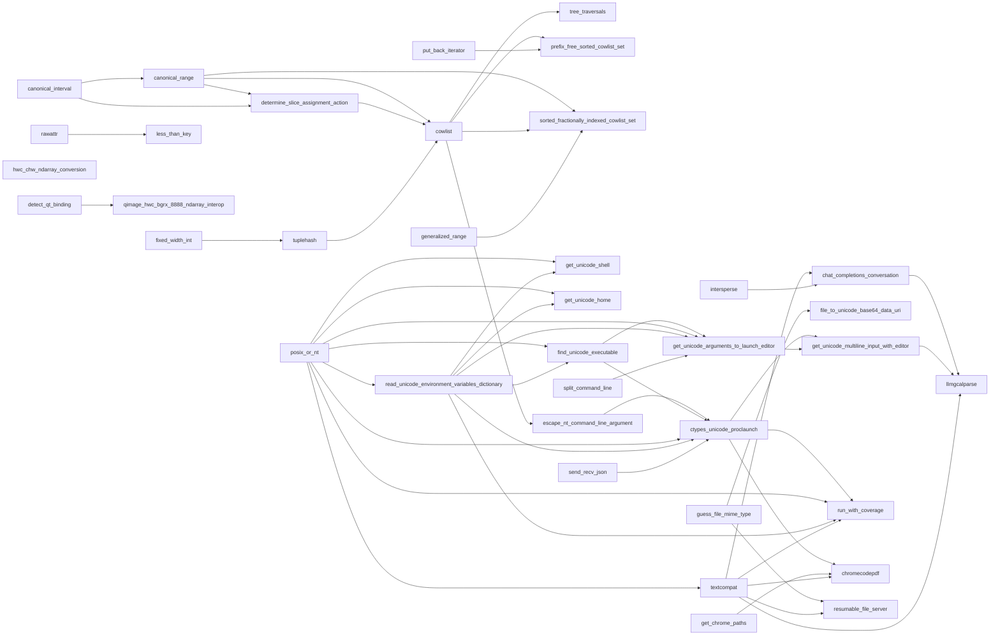

```mermaid
graph LR
    posix_or_nt --> textcompat

    textcompat --> chat_completions_conversation
    intersperse --> chat_completions_conversation

    canonical_interval --> canonical_range

    canonical_range --> determine_slice_assignment_action
    canonical_interval --> determine_slice_assignment_action
    
    fixed_width_int --> tuplehash

    canonical_range --> cowlist
    determine_slice_assignment_action --> cowlist
    tuplehash --> cowlist
    
    cowlist --> tree_traversals

    rawattr --> less_than_key

    cowlist --> prefix_free_sorted_cowlist_set
    put_back_iterator --> prefix_free_sorted_cowlist_set

    canonical_range --> sorted_fractionally_indexed_cowlist_set
    cowlist --> sorted_fractionally_indexed_cowlist_set
    generalized_range --> sorted_fractionally_indexed_cowlist_set

    posix_or_nt --> read_unicode_environment_variables_dictionary

    posix_or_nt --> get_unicode_shell
    read_unicode_environment_variables_dictionary --> get_unicode_shell

    posix_or_nt --> get_unicode_home
    read_unicode_environment_variables_dictionary --> get_unicode_home

    posix_or_nt --> find_unicode_executable
    read_unicode_environment_variables_dictionary --> find_unicode_executable

    find_unicode_executable --> get_unicode_arguments_to_launch_editor
    posix_or_nt --> get_unicode_arguments_to_launch_editor
    read_unicode_environment_variables_dictionary --> get_unicode_arguments_to_launch_editor
    split_command_line --> get_unicode_arguments_to_launch_editor

    guess_file_mime_type --> file_to_unicode_base64_data_uri

    send_recv_json

    cowlist --> escape_nt_command_line_argument

    hwc_chw_ndarray_conversion

    escape_nt_command_line_argument --> ctypes_unicode_proclaunch
    find_unicode_executable --> ctypes_unicode_proclaunch
    posix_or_nt --> ctypes_unicode_proclaunch
    read_unicode_environment_variables_dictionary --> ctypes_unicode_proclaunch
    send_recv_json --> ctypes_unicode_proclaunch

    ctypes_unicode_proclaunch --> get_unicode_multiline_input_with_editor
    get_unicode_arguments_to_launch_editor --> get_unicode_multiline_input_with_editor

    chat_completions_conversation --> llmgcalparse
    get_unicode_multiline_input_with_editor --> llmgcalparse
    textcompat --> llmgcalparse

    ctypes_unicode_proclaunch --> run_with_coverage
    posix_or_nt --> run_with_coverage
    read_unicode_environment_variables_dictionary --> run_with_coverage
    textcompat --> run_with_coverage

    ctypes_unicode_proclaunch --> chromecodepdf
    get_chrome_paths --> chromecodepdf
    textcompat --> chromecodepdf

    guess_file_mime_type --> resumable_file_server
    textcompat --> resumable_file_server

    detect_qt_binding --> qimage_hwc_bgrx_8888_ndarray_interop
```