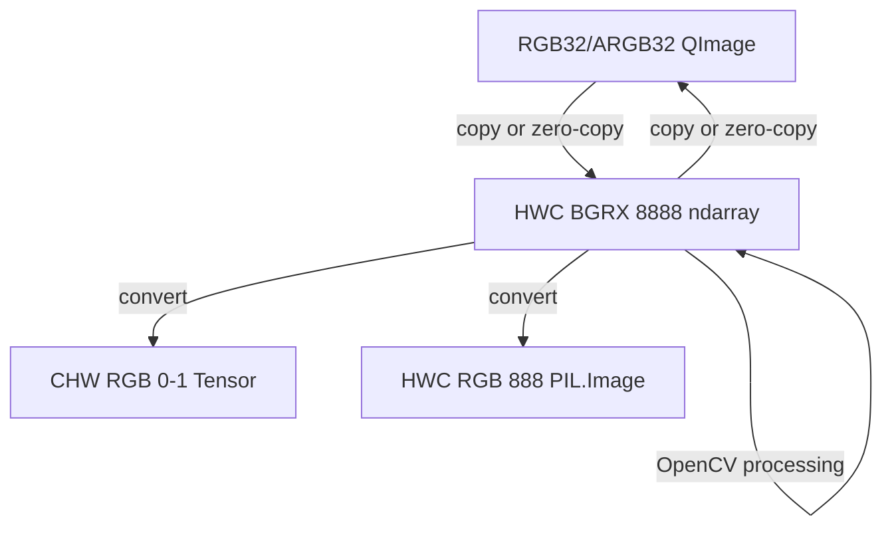

Just as the central dogma in molecular biology describes genetic information flow from DNA to RNA to protein, we can use a similar terminology to describe how pixels flow from GUI to classic CV algorithms to deep learning-based CV models in GUI CV applications.

The Central Dogma of GUI CV Applications:

## Step-by-Step

### RGB32/ARGB32 QImage <-> HWC BGRX 8888 ndarray

Both [copy and zero-copy](https://github.com/jifengwu2k/qimage-hwc-bgrx-8888-ndarray-interop) are possible. However, pay attention to memory lifetime and whether the ndarray is contiguous!

### HWC BGRX 8888 ndarray -> HWC BGRX 8888 ndarray

A common preprocessing step is [letterboxing](https://github.com/jifengwu2k/hwc-ndarray-letterbox), such as for YOLO object detection models.

### HWC BGRX 8888 ndarray -> CHW RGB 0-1 Tensor

A [conversion procedure](https://github.com/jifengwu2k/hwc-bgrx-8888-ndarray-to-chw-rgb-0-1-tensor) is required to feed images to PyTorch models, which often uses CHW RGB tensors with pixel values normalized to `[0, 1]`.

### HWC BGRX 8888 ndarray -> HWC RGB 888 PIL.Image

A [conversion procedure](https://github.com/jifengwu2k/hwc-bgrx-8888-ndarray-to-pil-image) is also required to target `PIL.Image`s.
