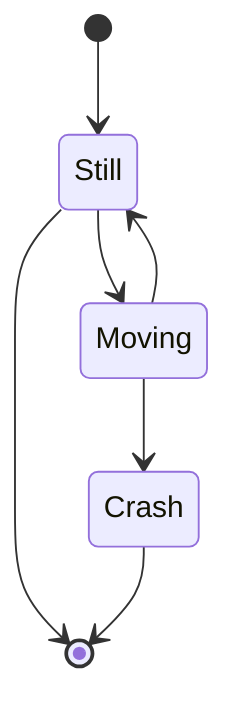
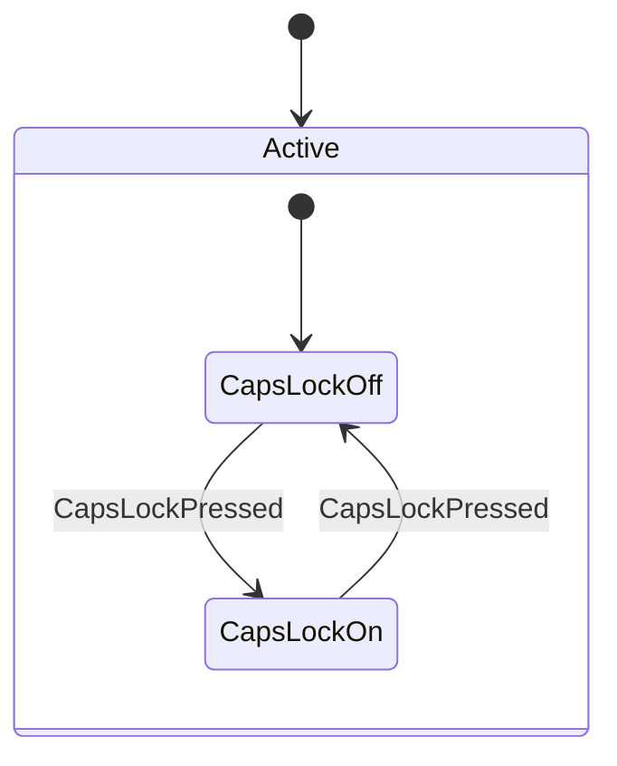
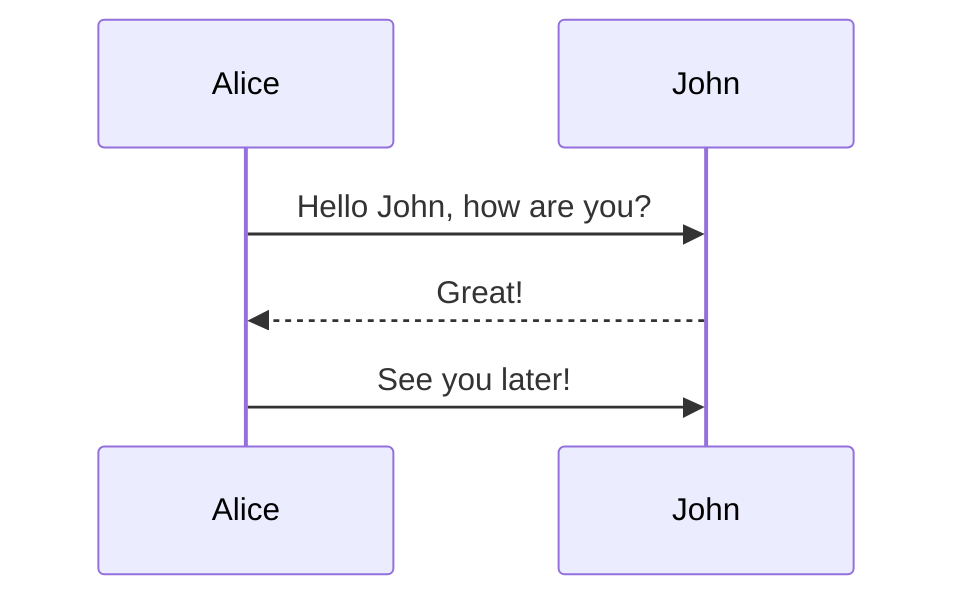
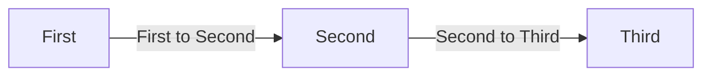
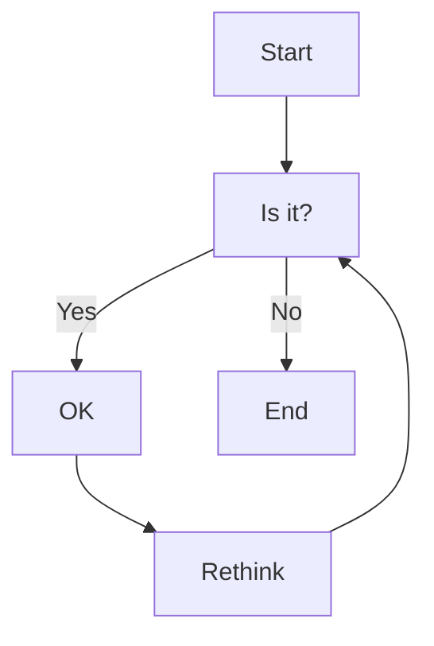

## Structural Diagrams

> **Structural diagrams** show the structure or organization of an **entity** - how components are arranged and related - rather than events or interactions.

### Mind Map

> A mind map is a hierarchical diagram that visually organizes ideas, tasks, or concepts, typically radiating from a central theme.

#### PlantUML

```plaintext
@startmindmap
* Debian
** Ubuntu
*** Linux Mint
*** Kubuntu
*** Lubuntu
*** KDE Neon
** LMDE
** SolydXK
** SteamOS
** Raspbian with a very long name
*** OSMC
*** Volumio
@endmindmap
```


```
@startmindmap
+ OS
++ Ubuntu
+++ Linux Mint
+++ Kubuntu
+++ Lubuntu
+++ KDE Neon
++ LMDE
++ SolydXK
++ SteamOS
++ Raspbian
-- Windows 95
-- Windows 98
-- Windows NT
--- Windows 8
--- Windows 10
@endmindmap
```


### Work Breakdown Structure Diagram

> A work breakdown structure diagram breaks down a goal or project into manageable parts or tasks in a hierarchical structure, making it easier to see how work is organized.

#### PlantUML

```plaintext
@startwbs
* Business Process Modelling WBS
** Launch the project
*** Complete Stakeholder Research
*** Initial Implementation Plan
** Design phase
*** Model of AsIs Processes Completed
**** Model of AsIs Processes Completed1
**** Model of AsIs Processes Completed2
*** Measure AsIs performance metrics
*** Identify Quick Wins
** Complete innovate phase
@endwbs
```


```plaintext
@startwbs
+ New Job
++ Decide on Job Requirements
+++ Identity gaps
+++ Review JDs
++++ Sign-Up for courses
++++ Volunteer
++++ Reading
++- Checklist
+++- Responsibilities
+++- Location
++ CV Upload Done
+++ CV Updated
++++ Spelling & Grammar
++++ Check dates
---- Skills
+++ Recruitment sites chosen
@endwbs
```


### JSON/YAML Diagram

> A visual representation of structured data, such as a JSON or YAML file, showing how data fields is organized.

#### PlantUML

```plaintext
@startjson
{
    "firstName": "John",
    "lastName": "Smith",
    "isAlive": true,
    "age": 27,
    "address": {
        "streetAddress": "21 2nd Street",
        "city": "New York",
        "state": "NY",
        "postalCode": "10021-3100"
    },
    "phoneNumbers": [
        {
            "type": "home",
            "number": "212 555-1234"
        },
        {
            "type": "office",
            "number": "646 555-4567"
        }
    ],
    "children": [],
    "spouse": null
}
@endjson
```


```plaintext
@startyaml
doe: "a deer, a female deer"
ray: "a drop of golden sun"
pi: 3.14159
xmas: true
french-hens: 3
calling-birds:
    - huey
    - dewey
    - louie
    - fred
xmas-fifth-day:
    calling-birds: four
    french-hens: 3
    golden-rings: 5
    partridges:
        count: 1
        location: "a pear tree"
    turtle-doves: two
@endyaml
```


### Network Diagram

#### PlantUML

> A diagram that shows the layout and connections between components or entities in a network, such as devices or organizational units.

```plaintext
@startuml
nwdiag {
    network dmz {
        address = "210.x.x.x/24"

        // set multiple addresses (using comma)
        web01 [address = "210.x.x.1, 210.x.x.20"];
        web02 [address = "210.x.x.2"];
    }
    network internal {
        address = "172.x.x.x/24";

        web01 [address = "172.x.x.1"];
        web02 [address = "172.x.x.2"];
        db01;
        db02;
    }
}
@enduml
```


## Behavioral Diagrams

> **Behavioral diagrams** illustrate the dynamic aspects of **entities** - how they operates and changes over time. These diagrams focus on state changes, activities, workflows and communication.

### State Diagram

> Illustrates the different states an entity can be in, and the transitions between them in response to events.

#### Mermaid

```plaintext
stateDiagram-v2
    [*] --> Still
    Still --> [*]

    Still --> Moving
    Moving --> Still
    Moving --> Crash
    Crash --> [*]
```



```plaintext
stateDiagram-v2
    [*] --> Active

    state Active {
        [*] --> CapsLockOff
        CapsLockOff --> CapsLockOn : CapsLockPressed
        CapsLockOn --> CapsLockOff : CapsLockPressed
    }
```



#### PlantUML

```
@startuml
[*] --> State1
State1 --> [*]
State1 --> State2
State2 --> [*]
@enduml
```


```
@startuml
[*] --> NotShooting

state NotShooting {
    [*] --> Idle
    Idle --> Configuring : Config
    Configuring --> Idle : Config
}

state Configuring {
    [*] --> NewValueSelection
    NewValueSelection --> NewValuePreview : NewValue
    NewValuePreview --> NewValueSelection : NewValueRejected
    NewValuePreview --> NewValueSelection : NewValueSaved

    state NewValuePreview {
        State1 --> State2
    }
}
@enduml
```


### Sequence Diagram

> Shows the interactions between different entities over time, emphasizing order and timing.

Mermaid:

```plaintext
sequenceDiagram
    Alice ->> John: Hello John, how are you?
    John -->> Alice: Great!
    Alice ->> John: See you later!
```



PlantUML:

```plaintext
@startuml
Alice -> Bob: Authentication Request
Bob --> Alice: Authentication Response
Alice -> Bob: Another authentication Request
Bob --> Alice: Another authentication Response
@enduml
```


## Flow Chart / Flow Diagram / Activity Diagram

> Charts the step-by-step actions and decisions in a **process**, clarifying how things progress from start to finish.

### Mermaid

```plaintext
flowchart LR
    First -- First to Second --> Second
    Second -- Second to Third --> Third
```



```plaintext
flowchart TD
    Start --> Is_it[Is it?]
    Is_it -- Yes --> OK
    OK --> Rethink
    Rethink --> Is_it
    Is_it -- No --> End
```



### PlantUML

```plaintext
@startuml
start
:Text 1;
:Text 2;
stop
@enduml
```


```plaintext
@startuml
start
if (condition A) then (yes)
    :Text 1;
(no) elseif (condition B) then (yes)
    :Text 2;
(no) elseif (condition C) then (yes)
    :Text 3;
(no) elseif (condition D) then (yes)
    :Text 4;
else (no)
    :Text 5;
endif
stop
@enduml
```


```plaintext
@startuml
start
switch (test?)
case ( condition A )
    :Text 1;
case ( condition B )
    :Text 2;
case ( condition C )
    :Text 3;
case ( condition D )
    :Text 4;
case ( condition E )
    :Text 5;
endswitch
stop
@enduml
```


```plaintext
@startuml
start
while (data available?) is (yes)
    :read data;
    :generate diagrams;
endwhile (no)
stop
@enduml
```


```plaintext
@startuml
start
repeat
    :read data;
    :generate diagrams;
repeat while (more data?) is (yes) not (no)
stop
@enduml
```


```plaintext
@startuml
start
fork
    :action 1;
fork again
    :action 2;
end fork
stop
@enduml
```

